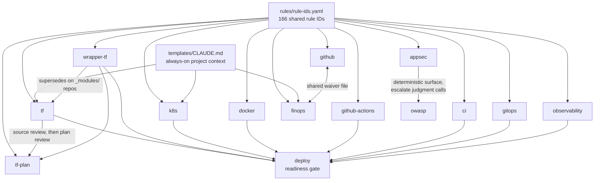

# devops-skills

> **One source of DevOps expertise, three AI coding tools.** Reusable skills for **Claude Code**, **Cursor**, and **Codex** that review and scaffold Terraform, Kubernetes/Helm, Docker, CI/CD (GitHub Actions + GitLab), AWS FinOps, GitHub repo hygiene, and OWASP security, without you copy-pasting the same prompt into every project.

[](https://github.com/anmolnagpal/devops-skills/actions/workflows/test.yml)
[](https://github.com/anmolnagpal/devops-skills/releases)
[](LICENSE)


### Install in Claude Code (10 seconds, no clone)

```text
/plugin marketplace add anmolnagpal/devops-skills
/plugin install clouddrove@devops-skills
```

Skills land as `/clouddrove:tf`, `/clouddrove:finops`, … with a native `(clouddrove)` label. Cursor, Codex, and MCP servers need the [installer](#install).

**Contents:** [What you get](#what-you-get) · [See it in action](#see-it-in-action) · [Install](#install) · [Skills](#skills) · [Project context](#always-on-project-context) · [Why this](#why-this-not-the-alternatives) · [Plugins](#plugins) · [MCP servers](#mcp-servers) · [Repo layout](#repository-structure) · [Versioning](#versioning) · [Contributing](#contributing)

## What you get

- **16 skills** that auto-trigger on file globs and answer with structured, rule-ID-tagged review output, grouped into [seven categories](#skills)
- **Packaged as the `clouddrove` plugin**: installed from this repo's own marketplace, so skills are namespaced `(clouddrove)` in Claude Code natively
- **Single source** in `skills/<name>/SKILL.md`. A generator emits Cursor `.mdc` rules and Codex `AGENTS.md` so every tool stays in sync
- **One installer** with flags: `--claude` / `--cursor` / `--codex` / `--all`, global or per-project scope
- **Curated Claude plugin set**: Terraform code/module generation (HashiCorp), claude-mem, superpowers, caveman, engineering-workflow-skills
- **MCP servers** wired in: Kubernetes live access, EKS ops, AWS Cost Explorer, Atlassian (Jira + Confluence), Outline docs/wiki

> **New here?** Skip to **[CHEATSHEET.md](_docs/CHEATSHEET.md)** for one-line prompts per skill.

## See it in action

Every review answers in the same shape: **BLOCKING** (must fix) and **ADVISORY** (should fix), each finding tagged with a stable rule ID and a `file:line`, then a one-line summary.

**`/clouddrove:tf review`** (pre-MR Terraform check):

```text
BLOCKING — Must fix before MR
[main.tf:14] TF-STATE-001 No remote backend — state would live on a laptop
  → add a `backend "s3"` block with DynamoDB state locking
[rds.tf:31] TF-VAR-001 Hardcoded DB password in `default` → move to a variable,
  mark `sensitive = true`, source from AWS Secrets Manager
[versions.tf:1] TF-PROV-001 Provider not version-pinned → pin `aws ~> 5.0`

ADVISORY — Should fix
[s3.tf:8] TF-RES-001 Bucket missing required tags (Environment, Team, ManagedBy)
[variables.tf:5] TF-VAR-003 `instance_type` has no description/type

Summary: 3 blocking issue(s), 2 advisory issue(s).
```

**`/clouddrove:finops`** (AWS cost review):

```text
BLOCKING — none

ADVISORY — Should fix
[ebs] COST-STOR-003 12 gp2 volumes not migrated to gp3 → ~20% cheaper + faster,
  online conversion, no downtime. Run scripts/ebs-gp2-to-gp3-audit.sh — est. $340/mo
[vpc] COST-NET-001 Per-AZ NAT gateways in 3 AZs for a non-prod account
  → consolidate to 1 or use VPC endpoints — est. $190/mo

Summary: 0 blocking, 2 advisory. Estimated saving: ~$530/month.
```

**`/clouddrove:deploy`** (production-readiness gate before first prod release):

```text
PRODUCTION READINESS — payments-api → prod

BLOCKING — Must fix before deploy
[helm/values-prod.yaml:22] ARCH-SPOF-002 replicaCount: 1 — single pod, no HA
[helm/values-prod.yaml] ARCH-HA-003 No readiness/liveness probes
[.github/workflows/deploy.yml:40] CICD-FLOW-002 No manual prod approval gate

ADVISORY — Should fix
[helm/values-prod.yaml] OBS-MON-002 No alerting configured

Gate: FAILED — 3 blocking. Recommended strategy: blue-green (stateful, first prod release).
```

> Outputs above are representative. Findings, rule IDs, and `file:line` are real to your repo when you run the skill.

## Install

Works with **Claude Code**, **Cursor**, and **Codex** (same skills, different injection per tool). Pick the path that fits how your team consumes the repo.

### 1. Claude Code plugin (no clone)

```text
/plugin marketplace add anmolnagpal/devops-skills
/plugin install clouddrove@devops-skills
```

Skills appear as `/clouddrove:tf`, `/clouddrove:deploy`, … Does not install Cursor rules, Codex `AGENTS.md`, team plugins, or MCP servers.

### 2. Installer one-liner (recommended, all tools)

```bash
# Claude Code only
/bin/bash -c "$(curl -fsSL https://raw.githubusercontent.com/anmolnagpal/devops-skills/main/scripts/bootstrap.sh)" -- --claude

# All three tools
/bin/bash -c "$(curl -fsSL https://raw.githubusercontent.com/anmolnagpal/devops-skills/main/scripts/bootstrap.sh)" -- --all

# Interactive (no flags): prompts for which tools
/bin/bash -c "$(curl -fsSL https://raw.githubusercontent.com/anmolnagpal/devops-skills/main/scripts/bootstrap.sh)"
```

| Flag | What it installs |
|------|------------------|
| `--claude` | `clouddrove` skills plugin (from this repo's marketplace), team plugins from `config/plugins.txt`, MCP servers |
| `--cursor` | `.cursor/rules/*.mdc` into `~/.cursor/rules/` (or `--project <path>`) |
| `--codex`  | `AGENTS.md` into `~/.codex/AGENTS.md` (or `--project <path>`) |
| `--all`    | All three |

Narrower runs:

```bash
./scripts/install.sh --claude --no-mcp --no-plugins   # skills only
./scripts/install.sh --cursor --project ~/work/repo   # per-project install
./scripts/install.sh --codex  --project ~/work/repo
```

**Updating:** re-run the same one-liner. If the repo is already installed it pulls the latest and re-runs the installer.

### 3. `npx skills` (any of 70+ agents)

The [open Agent Skills CLI](https://github.com/vercel-labs/skills) reads this repo directly, so tools outside Claude/Cursor/Codex can consume the same skills:

```bash
npx skills add anmolnagpal/devops-skills --list          # show the 16 skills
npx skills add anmolnagpal/devops-skills -s tf,k8s       # install two
npx skills add anmolnagpal/devops-skills --all           # all skills, all detected agents
npx skills add anmolnagpal/devops-skills -g              # user-level instead of project-level
```

Installs the skill bodies only. Team plugins, MCP servers, and the settings template need path 2.

### 4. Clone (SSH, or a custom install dir)

```bash
git clone git@github.com:anmolnagpal/devops-skills.git ~/devops-skills
~/devops-skills/scripts/install.sh --all
```

### 5. Git submodule (pin a version per project repo)

Best when a project needs a reproducible skill set that moves only when you bump it:

```bash
git submodule add https://github.com/anmolnagpal/devops-skills .devops-skills
git -C .devops-skills checkout v1.2.0            # pin a release (see releases page)
./.devops-skills/scripts/install.sh --cursor --codex --project .
git add .gitmodules .devops-skills .cursor AGENTS.md
```

Teammates get it with `git submodule update --init`. Bump with `git -C .devops-skills fetch --tags && git -C .devops-skills checkout <tag>`, then re-run the installer.

### 6. Fork and customize (your own rule catalog)

For teams that need different severities, extra rule IDs, or company-specific skills:

1. Fork the repo.
2. Edit `rules/rule-ids.yaml` and `skills/<name>/SKILL.md`.
3. Run `bash scripts/generate.sh` (rebuilds Cursor + Codex adapters).
4. Point Claude Code at your fork: `/plugin marketplace add <your-org>/devops-skills`.

CI carries over with the fork, so your changes keep the same six gates. Merge upstream with `git remote add upstream https://github.com/anmolnagpal/devops-skills`.

### What the installer writes to your machine

`install.sh --claude` seeds `~/.claude/settings.json` from `templates/settings.json` on first run. On subsequent runs it **merges missing permission entries only**; it never clobbers existing keys (`enabledPlugins`, `mcpServers`, `hooks`, …).

The template ships a safe DevOps allow-list (read-only kubectl/terraform/aws/git) and a deny-list (`kubectl delete`, `terraform apply`, `terraform destroy`, `rm -rf`, `aws s3 rm`, `aws ec2 terminate-instances`). The plugin also registers two hooks: a `SessionStart` context banner and a `PreToolUse` bash-guard that blocks destructive commands.

`install.sh` is idempotent: already-installed plugins, MCP servers, and symlinks are reused.

---

## Skills

Single source: `skills/<name>/SKILL.md`. The `clouddrove` plugin bundles all 16; `scripts/generate.sh` emits `.cursor/rules/<name>.mdc` for Cursor and one `AGENTS.md` for Codex from the same file.

Invoke with `/clouddrove:<skill>` in Claude Code. In Cursor, rules auto-attach via `globs:`. In Codex, `AGENTS.md` loads by default.

### Infrastructure as Code

| Skill | Purpose | Auto-trigger |
|---|---|---|
| `/clouddrove:tf` | Terraform on the `terraform-aws-modules` ecosystem: pre-MR review, AWS resource scaffolding, provider upgrade guidance | `**/*.tf`, `**/*.tfvars` |
| `/clouddrove:wrapper-tf` | CloudDrove wrapper-module pattern: scaffold `_modules/<name>/`, generate Terraform GitHub Actions CI, review against the pattern, map to SOC2/GDPR controls. Supersedes `tf` on these repos | `_modules/**/*.tf`, `environments/**/*.tf`, `.github/workflows/terraform.yml` |
| `/clouddrove:tf-plan` | Reviews the **plan**, not the source: destroys and replacements of data-bearing resources, secrets readable in plan output, drift, blast radius, and whether apply is bound to the plan you reviewed | `**/tfplan*.json` |

### Containers and orchestration

| Skill | Purpose | Auto-trigger |
|---|---|---|
| `/clouddrove:k8s` | Kubernetes/Helm: pre-deploy review, production-ready values scaffolding | `**/values*.yaml`, `**/Chart.yaml`, `**/templates/*.yaml` |
| `/clouddrove:docker` | Dockerfile review, image optimization, Compose, registry workflows | `**/Dockerfile`, `**/docker-compose*.yml` |

### CI/CD

| Skill | Purpose | Auto-trigger |
|---|---|---|
| `/clouddrove:github-actions` | GitHub Actions: workflow review, security hardening (OIDC, action pinning), scaffolds | `**/.github/workflows/*.yml` |
| `/clouddrove:ci` | GitLab CI/CD: pipeline review, Terraform/Helm pipeline scaffolds | `**/.gitlab-ci.yml` |
| `/clouddrove:gitops` | Argo CD and Flux: mutable source refs, AppProject wildcard grants, unguarded auto-prune, sync waves, selfHeal drift enforcement, per-environment separation | `**/argocd/**/*.yaml`, `**/flux-system/**/*.yaml`, `**/*appproject*.yaml`, `**/*applicationset*.yaml`, `**/*helmrelease*.yaml` |

### Security

| Skill | Purpose | Auto-trigger |
|---|---|---|
| `/clouddrove:owasp` | Security review against OWASP Top 10:2025, ASVS 5.0, Agentic AI risks. Severity judged per finding by exploitability | manual |
| `/clouddrove:appsec` | Application-level security: dependency audit (runs the ecosystem's real audit tool), missing security headers, CORS wildcards. Deterministic, catalog severity | manual |

### Observability

| Skill | Purpose | Auto-trigger |
|---|---|---|
| `/clouddrove:observability` | Centralized logging, log retention, metrics scraping, alert rules that actually page a human, tracing, dashboards, SLO/SLI and burn-rate alerts | `**/prometheus*.y*ml`, `**/alertmanager*.y*ml`, `**/*rules*.yaml`, `**/otel-collector*.yaml`, `**/servicemonitor*.yaml` |

### Cost

| Skill | Purpose | Auto-trigger |
|---|---|---|
| `/clouddrove:finops` | AWS cost: waste detection, right-sizing, Savings Plans/RIs, EKS cost | manual |

### Delivery and process

| Skill | Purpose | Auto-trigger |
|---|---|---|
| `/clouddrove:deploy` | Deployment strategy (rolling/blue-green/canary), production-readiness gate, rollback playbook for AWS/EKS | manual |
| `/clouddrove:github` | GitHub repo hygiene: settings audit, CODEOWNERS, branch protection, releases, README/CONTRIBUTING/test-coverage checks | `**/CODEOWNERS`, `**/.github/dependabot.yml`, PR/issue templates |
| `/clouddrove:adr` | Capture architectural decisions as structured ADRs under `docs/adr/` | `**/docs/adr/*.md` |
| `/clouddrove:skill-creator` | Author, eval, and refine new skills in this repo | manual |

### How the skills relate

They are not 16 independent prompts. Two shared foundations sit under all of them, and several skills consume each other's output:



What that means in practice:

- **`tf` and `wrapper-tf` are mutually exclusive.** If the repo has an `_modules/` directory wrapping `clouddrove/*/aws` modules, use `wrapper-tf`; the two patterns conflict.
- **`deploy` aggregates, it does not re-derive.** Its readiness gate runs the artifact skills that apply to the repo and reuses their findings and rule IDs. If an artifact type exists but its skill was not run, the gate returns `INCOMPLETE` rather than claiming `READY`.
- **`appsec` and `owasp` split by determinism.** `appsec` checks things with a yes/no answer (a vulnerable lockfile entry, a missing header, a `*` CORS origin). `owasp` judges exploitability in context. Run `appsec` first, escalate the judgment calls.
- **`github` and `finops` share one waiver file**, same format and location, so a suppression written for one is readable by the other.

### Shared rule-ID vocabulary

Findings are tagged with stable rule IDs (`TF-STATE-001`, `SEC-NET-001`, `CICD-DOCK-002`, …). The canonical set lives in **[`rules/rule-ids.yaml`](rules/rule-ids.yaml)** (166 IDs across 10 domains), the single source of truth. CI (`scripts/check-rule-ids.sh`) fails if a skill emits an ID not in the registry. The [auditkit](https://github.com/clouddrove-ci/auditkit) audit engine consumes the same registry, so an inline plugin finding and a deep-audit finding share the same ID, and the two cannot drift.

### Severity models: three, by design

A finding's severity means something different depending on which skill raised it:

| Model | Used by | Meaning |
|---|---|---|
| **BLOCKING / ADVISORY**, fixed per rule ID | `tf`, `k8s`, `docker`, `ci`, `github-actions`, `github`, `appsec`, `wrapper-tf`, `deploy` | Severity is baked into the rule catalog; the skill never invents it. BLOCKING = fix before merge/deploy. |
| **BLOCKING / ADVISORY**, judged per finding | `owasp` | Same two labels, but severity depends on exploitability *in this codebase* (reachable? already mitigated?), assessed each time, not looked up. |
| **HIGH / MED / LOW $-impact** | `finops` | Cost findings are opportunities ranked by savings magnitude, never merge-blockers. There is no "block the MR" concept for a cost lever. |

All three carry the same stable rule-ID convention and `file:line`/resource citation; only the severity axis differs. If you script against the output (e.g. failing CI on BLOCKING), branch on the skill, not on a single global severity enum.

### Safety labels

Every skill declares its blast radius in frontmatter, and `scripts/check-skills.sh` fails the build if the label contradicts the skill's `allowed-tools`. So the guarantee is enforced, not asserted:

| Label | Skills | Means |
|---|---|---|
| `read-only` | `tf`, `tf-plan`, `k8s`, `ci`, `github-actions`, `gitops`, `owasp`, `deploy`, `observability` | Cannot mutate anything. Reads files, reports findings. |
| `runs-commands` | `docker`, `finops`, `github`, `appsec`, `wrapper-tf` | Shells out to real tooling (`npm audit`, `gh api`, `aws`, `docker`), writes no files. |
| `writes-files` | `adr`, `skill-creator` | Creates or edits files in your repo. |

Check any skill's label with `grep '^safety:' skills/<name>/SKILL.md`. The repo also ships a `PreToolUse` bash-guard hook that blocks destructive commands regardless of which skill asked.

### Backlog specs

`skills/specs/` holds drafts that are not runnable skills yet: aws-cost, aws-security, azure-cost, azure-security, gcp-cost, gcp-security, kubernetes-cost, kubernetes-security. Promote one by authoring `skills/<name>/SKILL.md` with frontmatter (see [CONTRIBUTING.md](CONTRIBUTING.md#promote-a-backlog-spec)).

---

## Always-on project context

Skills are sharper when they already know your AWS accounts, Terraform backend, EKS clusters, and team conventions. `templates/CLAUDE.md` is that shared context file: Claude Code auto-loads it every session, so you get the team's assumptions without invoking a skill at all.

```bash
cp ~/devops-skills/templates/CLAUDE.md /path/to/your/repo/CLAUDE.md
cp -r ~/devops-skills/templates/.claude /path/to/your/repo/.claude
# Fill in the CLAUDE.md placeholders, then commit both
```

Do this once per project repo. Every skill above reads it before reviewing, which is what keeps a `tf` review from suggesting a backend you already standardized on.

---

## Why this, not the alternatives

| Instead of… | You get here |
|---|---|
| **Copy-pasting the same prompt** into every repo | One versioned source, auto-triggers on file globs, namespaced `/clouddrove:<skill>`. Edit once, everyone pulls the update |
| **A generic skill pack** | Opinionated DevOps depth: real Terraform/EKS/Helm/FinOps/OWASP review and scaffolding, not vibes |
| **A static linter** (tfsec, checkov, hadolint) | In-context reasoning *and* scaffolding *and* explanation, in your editor. Linters still win on deterministic pattern checks, so run both |
| **Claude-only skills** | One source emits Cursor `.mdc` and Codex `AGENTS.md` too, so you get the same review across all three tools |
| **Prose findings** | Every finding carries a **stable rule ID** shared with the [auditkit](https://github.com/clouddrove-ci/auditkit) audit engine, so an inline review finding and a deep-audit finding are the *same* ID, so baselines and dedup carry across both |

**The honest line:** static linters are faster for pure pattern matching, and a deep audit engine (auditkit) is the executor for whole-repo + live-cloud scans. This plugin is the **IDE-time advisory layer** that speaks the same rule-ID language as that engine: review *before* you commit, with findings that line up when the auditor runs later. It's CI-tested (six gates), not just a prompt dump.

---

## Plugins

All plugins live in `config/plugins.txt` and are installed automatically by `install.sh`. Already-installed ones are skipped.

| Plugin | Source | What it adds |
|--------|--------|--------------|
| `terraform-code-generation` | hashicorp | Terraform style guide, registry search, import, tests |
| `terraform-module-generation` | hashicorp | Module refactoring and Terraform Stacks |
| `claude-mem` | thedotmack | Persistent cross-session memory, so Claude remembers past decisions and context |
| `engineering-workflow-skills` | mhattingpete | Git operations, code review, feature planning workflows |
| `superpowers` | obra/superpowers | TDD, systematic debugging, brainstorming/planning, subagent dev workflows |
| `caveman` | JuliusBrussee/caveman | Ultra-compressed communication mode, cuts ~75% tokens while preserving technical accuracy |

Adding one: see [CONTRIBUTING.md](CONTRIBUTING.md#add-a-plugin).

---

## MCP Servers

Configured interactively during `install.sh`. Each server prompts you to install or skip; already-installed servers are skipped automatically.

| Server | What it gives Claude |
|--------|---------------------|
| `kubernetes-mcp-server` | Live read access to EKS clusters: pods, logs, events, Helm releases |
| `eks-mcp-server` | AWS-native EKS ops: cluster diagnostics, CloudWatch, IAM/OIDC, resource management |
| `billing-mcp-server` | Cost Explorer, budget tracking, savings plan analysis, Compute Optimizer |
| `mcp-atlassian` | Jira + Confluence: JQL search, create/update issues, add comments, transition tickets |
| `outline` | Outline docs/wiki: search, read, create/update documents (remote HTTP, browser OAuth) |

### Switching AWS profile

```bash
~/devops-skills/scripts/set-aws-profile.sh          # interactive
~/devops-skills/scripts/set-aws-profile.sh prod     # direct
```

Restart Claude Code after switching. Adding a server: see [CONTRIBUTING.md](CONTRIBUTING.md#add-an-mcp-server).

---

## Repository Structure

```
devops-skills/
  .claude-plugin/            ← plugin.json (clouddrove) + marketplace.json (repo = its own marketplace)
  skills/                    ← Canonical skill sources, one dir per skill (edit here)
    <name>/SKILL.md          ← the skill body (tf, k8s, ci, owasp, docker, finops, deploy, adr, wrapper-tf, …)
    <name>/evals/            ← static eval fixtures + validate.sh (file-input skills)
    owasp/*.md               ← reference docs loaded on-demand; docker/ finops/ add scripts too
    specs/                   ← Backlog spec docs (not active skills)
  rules/rule-ids.yaml        ← Canonical shared rule-ID registry (single source of truth)
  .cursor/rules/             ← Generated Cursor rules (.mdc), from scripts/generate.sh
  AGENTS.md                  ← Generated Codex skill doc, from scripts/generate.sh
  agents/                    ← Reserved for Claude Code agents
  hooks/                     ← Shipped with the plugin (registered via hooks.json)
    hooks.json               ← Plugin hook config (uses ${CLAUDE_PLUGIN_ROOT})
    session-banner.sh        ← SessionStart: prints repo/branch/AWS/kube context
    bash-guard.sh            ← PreToolUse(Bash): blocks destructive patterns
  templates/
    CLAUDE.md                ← Copy into project repos for always-on team context
    settings.json            ← Global ~/.claude/settings.json defaults (perm allow/deny)
  scripts/
    bootstrap.sh             ← One-liner installer
    install.sh               ← Flag dispatcher (--claude / --cursor / --codex / --all)
    install-claude.sh        ← Claude adapter: skills, plugins, MCP
    install-cursor.sh        ← Cursor adapter: links .cursor/rules
    install-codex.sh         ← Codex adapter: links AGENTS.md
    generate.sh              ← Build Cursor + Codex adapters from skills/<name>/SKILL.md
    mcp.sh                   ← Interactive MCP server install (Claude only)
    set-aws-profile.sh       ← Switch AWS profile for AWS MCP servers
  config/
    plugins.txt              ← Claude plugins to install
    marketplaces.txt         ← Claude plugin marketplaces
  _docs/
    CHEATSHEET.md            ← Example prompts per skill and MCP server
  _test/                     ← Dockerfile + test.sh for the install harness
  CHANGELOG.md  CONTRIBUTING.md  SECURITY.md  LICENSE  README.md
```

---

## Versioning

The plugin follows [Semantic Versioning](https://semver.org/spec/v2.0.0.html); every release is recorded in **[CHANGELOG.md](CHANGELOG.md)** ([Keep a Changelog](https://keepachangelog.com/en/1.1.0/) format). Current version: see `.claude-plugin/plugin.json` and the [releases page](https://github.com/anmolnagpal/devops-skills/releases).

What each bump means for you:

| Bump | What changed | What you do |
|---|---|---|
| **Patch** (1.3.0 → 1.3.1) | Rule wording, false-positive fixes, hook or script bugs | Nothing. Re-run the installer when convenient. |
| **Minor** (1.2.x → 1.3.0) | New skill, new rule IDs, new checks in an existing skill | Re-run the installer. Expect *more* findings than before; new BLOCKING rules can fail a previously-green review. |
| **Major** | Renamed or removed skills, changed rule IDs, changed output shape | Read the CHANGELOG entry first. Anything scripted against skill output or rule IDs may need updating. |

Upgrading:

```bash
/bin/bash -c "$(curl -fsSL https://raw.githubusercontent.com/anmolnagpal/devops-skills/main/scripts/bootstrap.sh)"
```

Same command as install; it pulls the latest and re-runs. In Claude Code alone: `/plugin update clouddrove@devops-skills`. On a submodule pin, checkout the new tag and re-run `scripts/install.sh`. Rule IDs are treated as a public contract: an ID's meaning never changes silently, and removals are called out in the CHANGELOG.

---

## Contributing

Issues and PRs are welcome. **[CONTRIBUTING.md](CONTRIBUTING.md)** covers the maintainer paths:

- [Add or improve a skill](CONTRIBUTING.md#add-or-improve-a-skill): skill file format, the generator step, eval cases
- [Add a rule ID](CONTRIBUTING.md#add-a-rule-id): registry first, then the skill catalog
- [Add a plugin](CONTRIBUTING.md#add-a-plugin) / [Add an MCP server](CONTRIBUTING.md#add-an-mcp-server)
- [Testing](CONTRIBUTING.md#testing): the six CI gates, plus the opt-in behavioral eval harness
- [Promote a backlog spec](CONTRIBUTING.md#promote-a-backlog-spec)

Before pushing, run the same checks CI runs:

```bash
bash scripts/check-skills.sh && bash scripts/check-rule-ids.sh \
  && bash scripts/check-evals.sh && bash scripts/generate.sh --check
```

Security issues: see [SECURITY.md](SECURITY.md).

## License

MIT, see [LICENSE](LICENSE).
