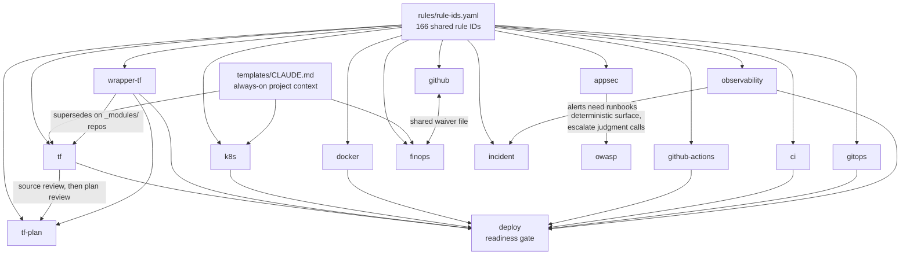

# Architecture

How the 17 skills relate, what a rule ID guarantees, why there are three severity
models, and what each skill is allowed to touch. Read this when you want to know
*why* a finding says what it says; the [README](../README.md) is enough to use them.

**Contents:** [How the skills relate](#how-the-skills-relate) · [Shared rule-ID vocabulary](#shared-rule-id-vocabulary) · [Severity models](#severity-models-three-by-design) · [Safety labels](#safety-labels) · [Project context](#always-on-project-context) · [Why this, not the alternatives](#why-this-not-the-alternatives) · [Plugins](#plugins) · [MCP servers](#mcp-servers) · [Versioning](#versioning)

### How the skills relate

They are not 17 independent prompts. Two shared foundations sit under all of them, and several skills consume each other's output:



What that means in practice:

- **`tf` and `wrapper-tf` are mutually exclusive.** If the repo has an `_modules/` directory wrapping `clouddrove/*/aws` modules, use `wrapper-tf`; the two patterns conflict.
- **`deploy` aggregates, it does not re-derive.** Its readiness gate runs the artifact skills that apply to the repo and reuses their findings and rule IDs. If an artifact type exists but its skill was not run, the gate returns `INCOMPLETE` rather than claiming `READY`.
- **`appsec` and `owasp` split by determinism.** `appsec` checks things with a yes/no answer (a vulnerable lockfile entry, a missing header, a `*` CORS origin). `owasp` judges exploitability in context. Run `appsec` first, escalate the judgment calls.
- **`github` and `finops` share one waiver file**, same format and location, so a suppression written for one is readable by the other.

### Shared rule-ID vocabulary

Findings are tagged with stable rule IDs (`TF-STATE-001`, `SEC-NET-001`, `CICD-DOCK-002`, …). The canonical set lives in **[`rules/rule-ids.yaml`](../rules/rule-ids.yaml)** (166 IDs across 10 domains), the single source of truth. CI (`scripts/check-rule-ids.sh`) fails if a skill emits an ID not in the registry. The [auditkit](https://github.com/clouddrove-ci/auditkit) audit engine consumes the same registry, so an inline plugin finding and a deep-audit finding share the same ID, and the two cannot drift.

### Severity models: three, by design

A finding's severity means something different depending on which skill raised it:

| Model | Used by | Meaning |
|---|---|---|
| **BLOCKING / ADVISORY**, fixed per rule ID | `tf`, `k8s`, `docker`, `ci`, `github-actions`, `github`, `appsec`, `wrapper-tf`, `deploy` | Severity is baked into the rule catalog; the skill never invents it. BLOCKING = fix before merge/deploy. |
| **BLOCKING / ADVISORY**, judged per finding | `owasp` | Same two labels, but severity depends on exploitability *in this codebase* (reachable? already mitigated?), assessed each time, not looked up. |
| **HIGH / MED / LOW $-impact** | `finops` | Cost findings are opportunities ranked by savings magnitude, never merge-blockers. There is no "block the MR" concept for a cost lever. |

All three carry the same stable rule-ID convention and `file:line`/resource citation; only the severity axis differs. If you script against the output (e.g. failing CI on BLOCKING), branch on the skill, not on a single global severity enum.

### Safety labels

Every skill declares its blast radius in frontmatter, and `scripts/check-skills.sh` fails the build if the label contradicts the skill's `allowed-tools`. So the guarantee is enforced, not asserted:

| Label | Skills | Means |
|---|---|---|
| `read-only` | `tf`, `tf-plan`, `k8s`, `ci`, `github-actions`, `gitops`, `owasp`, `deploy`, `observability` | Cannot mutate anything. Reads files, reports findings. |
| `runs-commands` | `docker`, `finops`, `github`, `appsec`, `wrapper-tf` | Shells out to real tooling (`npm audit`, `gh api`, `aws`, `docker`), writes no files. |
| `writes-files` | `adr`, `incident`, `skill-creator` | Creates or edits files in your repo. |

Check any skill's label with `grep '^safety:' skills/<name>/SKILL.md`. The repo also ships a `PreToolUse` bash-guard hook that blocks destructive commands regardless of which skill asked.

### Backlog specs

`skills/specs/` holds drafts that are not runnable skills yet: aws-cost, aws-security, azure-cost, azure-security, gcp-cost, gcp-security, kubernetes-cost, kubernetes-security. Promote one by authoring `skills/<name>/SKILL.md` with frontmatter (see [CONTRIBUTING.md](../CONTRIBUTING.md#promote-a-backlog-spec)).

---

## Always-on project context

Skills are sharper when they already know your AWS accounts, Terraform backend, EKS clusters, and team conventions. `templates/CLAUDE.md` is that shared context file: Claude Code auto-loads it every session, so you get the team's assumptions without invoking a skill at all.

```bash
cp ~/devops-skills/templates/CLAUDE.md /path/to/your/repo/CLAUDE.md
cp -r ~/devops-skills/templates/.claude /path/to/your/repo/.claude
# Fill in the CLAUDE.md placeholders, then commit both
```

Do this once per project repo. Every skill above reads it before reviewing, which is what keeps a `tf` review from suggesting a backend you already standardized on.

---

## Why this, not the alternatives

| Instead of… | You get here |
|---|---|
| **Copy-pasting the same prompt** into every repo | One versioned source, auto-triggers on file globs, namespaced `/clouddrove:<skill>`. Edit once, everyone pulls the update |
| **A generic skill pack** | Opinionated DevOps depth: real Terraform/EKS/Helm/FinOps/OWASP review and scaffolding, not vibes |
| **A static linter** (tfsec, checkov, hadolint) | In-context reasoning *and* scaffolding *and* explanation, in your editor. Linters still win on deterministic pattern checks, so run both |
| **Claude-only skills** | One source emits Cursor `.mdc` and Codex `AGENTS.md` too, so you get the same review across all three tools |
| **Prose findings** | Every finding carries a **stable rule ID** shared with the [auditkit](https://github.com/clouddrove-ci/auditkit) audit engine, so an inline review finding and a deep-audit finding are the *same* ID, so baselines and dedup carry across both |

**The honest line:** static linters are faster for pure pattern matching, and a deep audit engine (auditkit) is the executor for whole-repo + live-cloud scans. This plugin is the **IDE-time advisory layer** that speaks the same rule-ID language as that engine: review *before* you commit, with findings that line up when the auditor runs later. It's CI-tested (six gates), not just a prompt dump.

---

## Plugins

All plugins live in `config/plugins.txt` and are installed automatically by `install.sh`. Already-installed ones are skipped.

| Plugin | Source | What it adds |
|--------|--------|--------------|
| `terraform-code-generation` | hashicorp | Terraform style guide, registry search, import, tests |
| `terraform-module-generation` | hashicorp | Module refactoring and Terraform Stacks |
| `claude-mem` | thedotmack | Persistent cross-session memory, so Claude remembers past decisions and context |
| `engineering-workflow-skills` | mhattingpete | Git operations, code review, feature planning workflows |
| `superpowers` | obra/superpowers | TDD, systematic debugging, brainstorming/planning, subagent dev workflows |
| `caveman` | JuliusBrussee/caveman | Ultra-compressed communication mode, cuts ~75% tokens while preserving technical accuracy |

Adding one: see [CONTRIBUTING.md](../CONTRIBUTING.md#add-a-plugin).

---

## MCP Servers

Configured interactively during `install.sh`. Each server prompts you to install or skip; already-installed servers are skipped automatically.

| Server | What it gives Claude |
|--------|---------------------|
| `kubernetes-mcp-server` | Live read access to EKS clusters: pods, logs, events, Helm releases |
| `eks-mcp-server` | AWS-native EKS ops: cluster diagnostics, CloudWatch, IAM/OIDC, resource management |
| `billing-mcp-server` | Cost Explorer, budget tracking, savings plan analysis, Compute Optimizer |
| `mcp-atlassian` | Jira + Confluence: JQL search, create/update issues, add comments, transition tickets |
| `outline` | Outline docs/wiki: search, read, create/update documents (remote HTTP, browser OAuth) |

### Switching AWS profile

```bash
~/devops-skills/scripts/set-aws-profile.sh          # interactive
~/devops-skills/scripts/set-aws-profile.sh prod     # direct
```

Restart Claude Code after switching. Adding a server: see [CONTRIBUTING.md](../CONTRIBUTING.md#add-an-mcp-server).

---

## Versioning

The plugin follows [Semantic Versioning](https://semver.org/spec/v2.0.0.html); every release is recorded in **[CHANGELOG.md](../CHANGELOG.md)** ([Keep a Changelog](https://keepachangelog.com/en/1.1.0/) format). Current version: see `.claude-plugin/plugin.json` and the [releases page](https://github.com/anmolnagpal/devops-skills/releases).

What each bump means for you:

| Bump | What changed | What you do |
|---|---|---|
| **Patch** (1.3.0 → 1.3.1) | Rule wording, false-positive fixes, hook or script bugs | Nothing. Re-run the installer when convenient. |
| **Minor** (1.2.x → 1.3.0) | New skill, new rule IDs, new checks in an existing skill | Re-run the installer. Expect *more* findings than before; new BLOCKING rules can fail a previously-green review. |
| **Major** | Renamed or removed skills, changed rule IDs, changed output shape | Read the CHANGELOG entry first. Anything scripted against skill output or rule IDs may need updating. |

Upgrading:

```bash
/bin/bash -c "$(curl -fsSL https://raw.githubusercontent.com/anmolnagpal/devops-skills/main/scripts/bootstrap.sh)"
```

Same command as install; it pulls the latest and re-runs. In Claude Code alone: `/plugin update clouddrove@devops-skills`. On a submodule pin, checkout the new tag and re-run `scripts/install.sh`. Rule IDs are treated as a public contract: an ID's meaning never changes silently, and removals are called out in the CHANGELOG.

---

